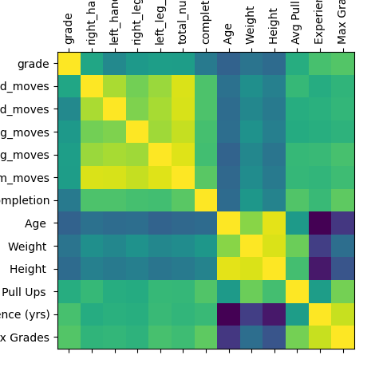
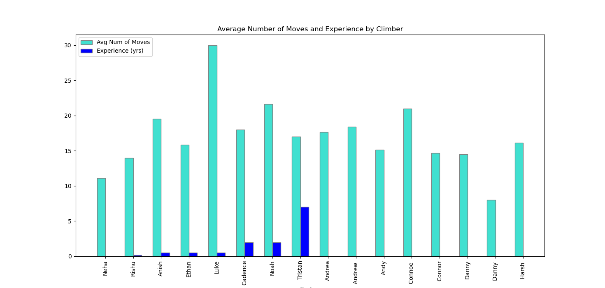
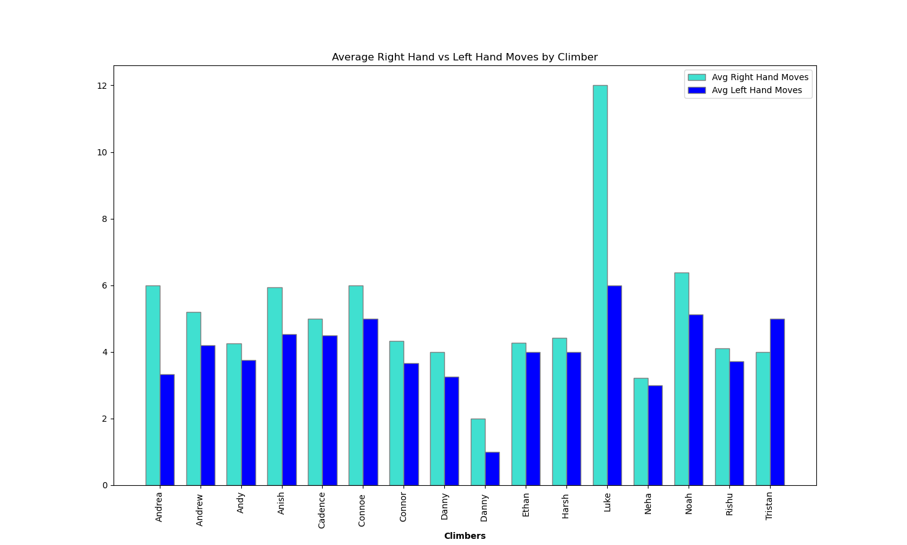

## Getting Started

1. Clone the repository:
   ```bash
   git clone <repository-link>
   ```

2. Navigate to the repository and install the required libraries:
   ```bash
   cd <repository-name>
   pip install matplotlib pandas numpy seaborn
   ```

3. Run the python script to process the data:
   ```bash
   python dt_pandas.py
   ```

## Analysis

We merged the climbing data with demographic data to derive insights and conclusions. The merged data can be found in `merged_demographics.csv`. The visualizations provide a clear representation of these findings.
# Bouldering Dataset Analysis

This repository contains data and visualizations related to a bouldering dataset. Our primary aim was to merge different demographic datasets with climbing data to draw meaningful conclusions.

## Files

- **Data Files**:
  - `climbing_data.csv`: Contains data related to climbing.
  - `demographics.csv`: Contains demographic data.
  - `correlation_matrix.csv`: Correlation matrix of the dataset.
  - `merged_demographics.csv`: A merged dataset combining climbing and demographic data.

- **Python Scripts**:
  - `dt_pandas.py`: Script for data processing using pandas.

- **Visualizations**:
  - `Figure_1.png`: Visualization 1 derived from the dataset.
  - `Figure_2.png`: Visualization 2 derived from the dataset.
  - `Figure_3.png`: Visualization 3 derived from the dataset.

## Prerequisites

### Software and Tools
- Python

### Libraries
- Matplotlib
- Pandas
- Numpy
- Seaborn


## Analysis

We merged the climbing data with demographic data to derive insights and conclusions. The merged data can be found in `merged_demographics.csv`. The visualizations provide a clear representation of these findings.

##  Visualizations
### Correlation Matrix: 







